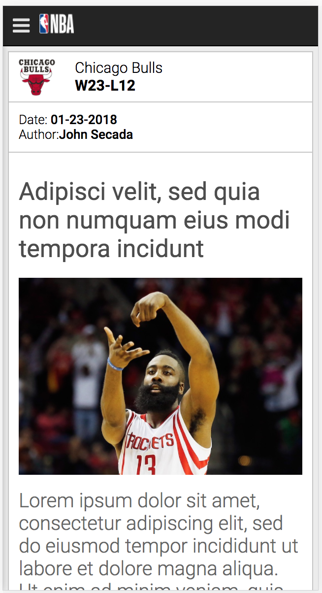
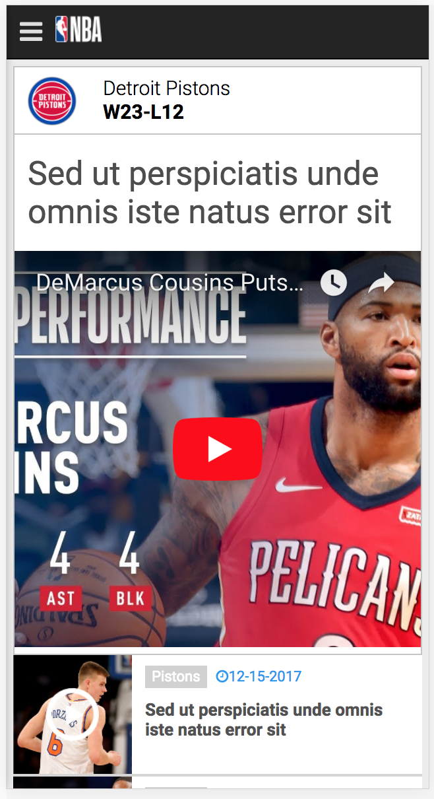
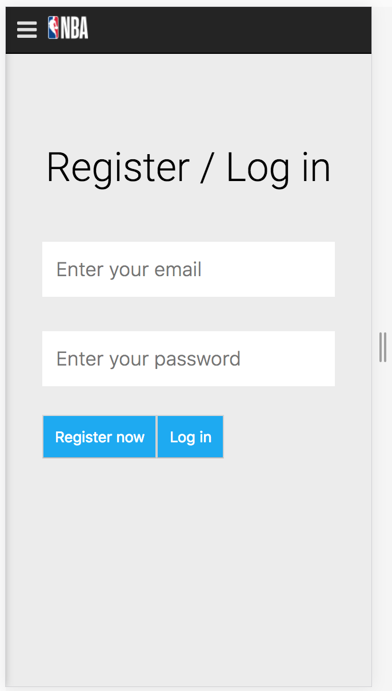
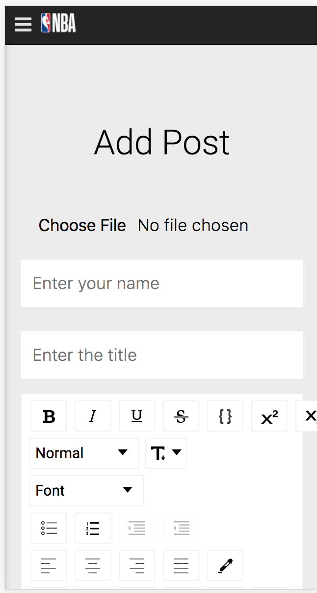

## MY NBA APP 2018
-------------------------------------------------
* Github: https://github.com/webbydon29/nba-final-q3
* Heroku: https://nba-apps-2018.herokuapp.com/
* Firebase: https://nba-2018-q3.firebaseapp.com/

##### Articles/News
<!--  -->


#### Videos
<!--  -->


#### Dashboard/login
<!--  -->


#### Add Post
<!--  -->


| Aricles/News | Videos | Dashboard/Login | Add Post |
|--------------|--------|-----------------|----------|
|| 
|  |  |


* Provide a brief description about your project that answers the following questions:
``` I'm creating an apps for Basketball Lovers, it includes latest movies, news, blogs, funny moments, best shots and many more. ```
---------------------------------------
* What problem or need does your project solve?
```I need to invest a lot of hours to finished at the same time mastering react. some of the modules are still hard for me to understand clearly. ```
--------------------------------------
* Who would be a user of your website?
```the user will be most likely those people that are inlove with NBA, sports and entertainments.```
----------------------------------------
* What technologies will you be using?
```i will be using reactJS, node modules NPM's ( npm i react-router-dom react-fontawesome react-simple-sidenav react-slick axios json-server –dev) and many more```
-----------------------------------


### My Journey in Creating this Apps

##### All credits to galvanize, to my teacher Adam for my Q3 projects, to my classmates for helping me reach my potentials, to Coding Revolution and Udemy Courses to enhance my learning

##### Steps
| Title | Commands | Comments |
|-------|----------|----------|
| setting up | create-react-app nba_2018 | creating a new projects |
| font-awesome | https://cdnjs.com/libraries/font-awesome | paste it on index.html|
| side-nav | https://www.npmjs.com/package/react-simple-sidenav | side navigation |
| slides react-slick | https://github.com/akiran/react-slick | for slides|
| Command line| yarn add react-router-dom react-fontawesome react-simple-sidenav react-slick –dev | dependencies i used. part 1 |
| CSS fonts | https://fonts.google.com/specimen/Roboto?selection.family=Roboto:300,400,500,700 | for css |
| Json Server | npm install –g json-server | https://github.com/typicode/json-server |
| new windows | json-server --watch db.json --port 3004 | must be on the same directory |
| axios | its a library to make a request  like fetch  | async request |
| refresh/restart | npm run dev-serv | restart watching |
| Firebase | Firebase | firebase |
| sign up | https://firebase.google.com/ | create your account |
|  console | top right | add project | gives you the dashboard application // will give you authentication  |
| Authentication | Database | hosting |
| firebase | 	npm install firebase@4.10.1 --save | imported json files |
| moments | npm install moment@2.20.1 --save | for setting to  autodate |
| authentication | enabled | enables password and email |
| Dashboard | setting up | where user can add/post articles, comments and so on |
| worpress | npm install react-draft-wysiwyg@1.12.1 --save | github.com/jpuri/react-draft-wysiwyg|
| html | npm install draft-js@0.10.4 draft-js-export-html@1.2.0 --save | convert to html file for articles|
| firebase uploader |	npm install react-firebase-uploader@2.4.1 --save | 	https://www.npmjs.com/package/react-firebase-file-uploader |
| building | npm run build | it will create a bundle for production that can rn though firebase or even heroku |
| tools |	npm install -g firebase-tools | initialization |
| firebase login | 	firebase init | 	firebase deploy |
